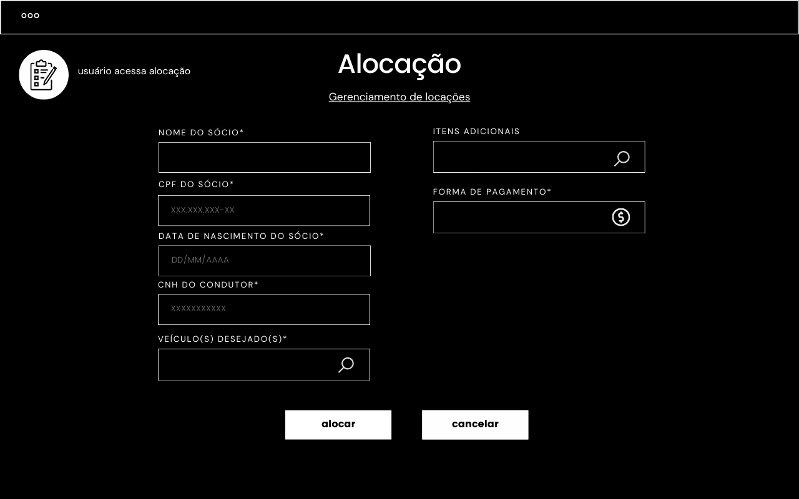
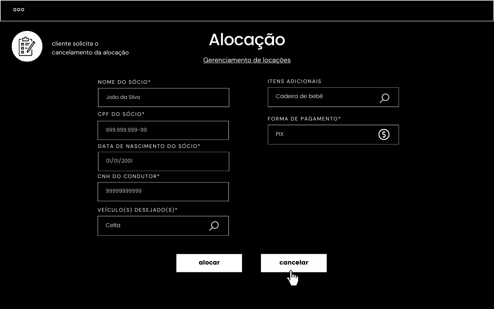
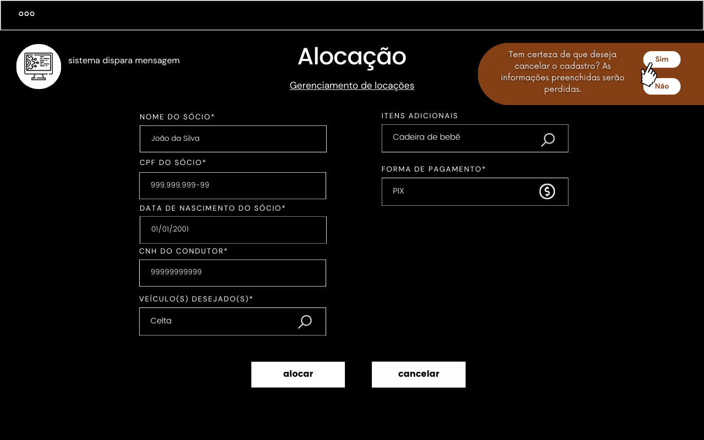
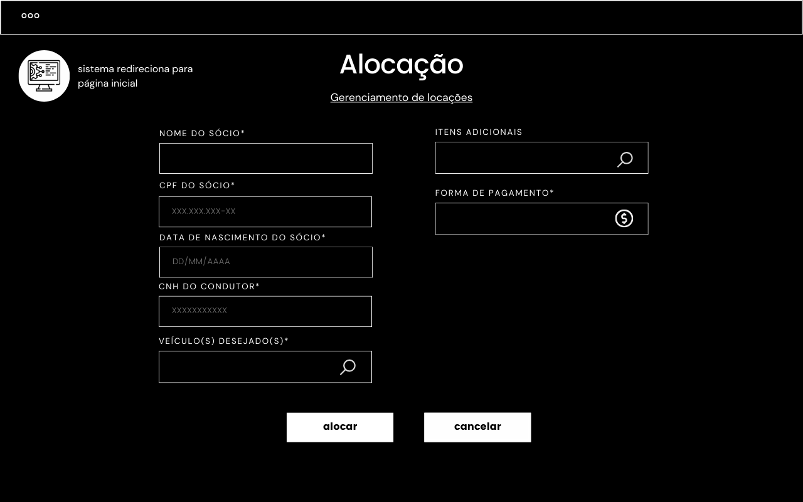

## Alocação de veículos

`REQ 03 - O sistema deve alocar os veículos, a partir das seguintes condições:`
 
`• É necessário registrar sócio;`
 
`• É necessário validar os condutores e suas respectivas CNHs;`
 
`• Cada carro tem condutor diferentes e únicos, exceto se esse for um sócio - o qual pode ser condutor de mais de um carro;`
 
`• Vários carros podem ser alocados;`
 
`• O veículo deverá estar disponível durante o período de alocação demandado;`
 
`• A alocação não pode ser de um sócio para o outro;`
 
`• A locação de veículos será impedida caso o cliente possua multas pendentes;`
 
`• Caso o sócio tenha 3 multas vinculadas a sua conta, a alocação não é possível;`
 
`• Um sócio não pode fazer uma alocação para outro sócio.`

**10º fluxo secundário - Cancelamento do processo de alocação**

| Protótipo |
| --- |
|  |
|  |
|  |
|  |
|  |
|  |
|  |
|  |
