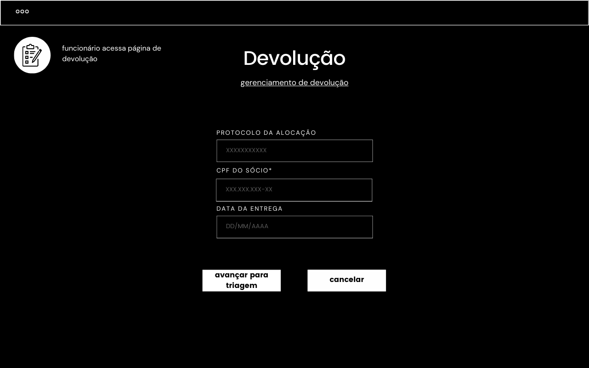
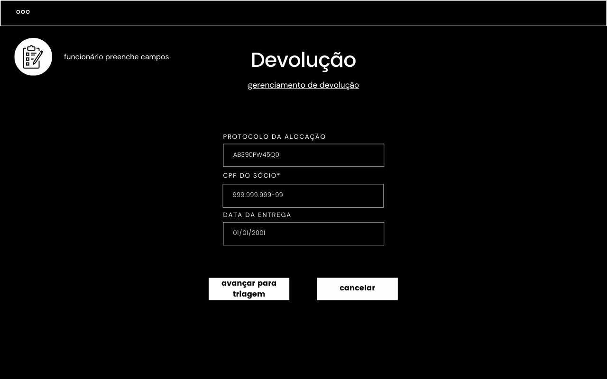
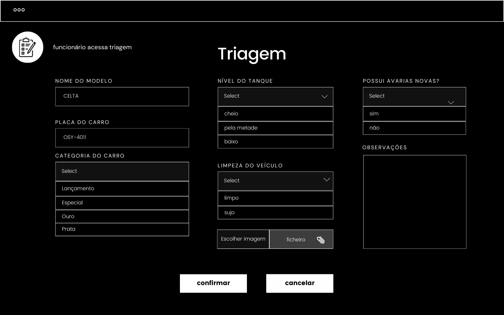
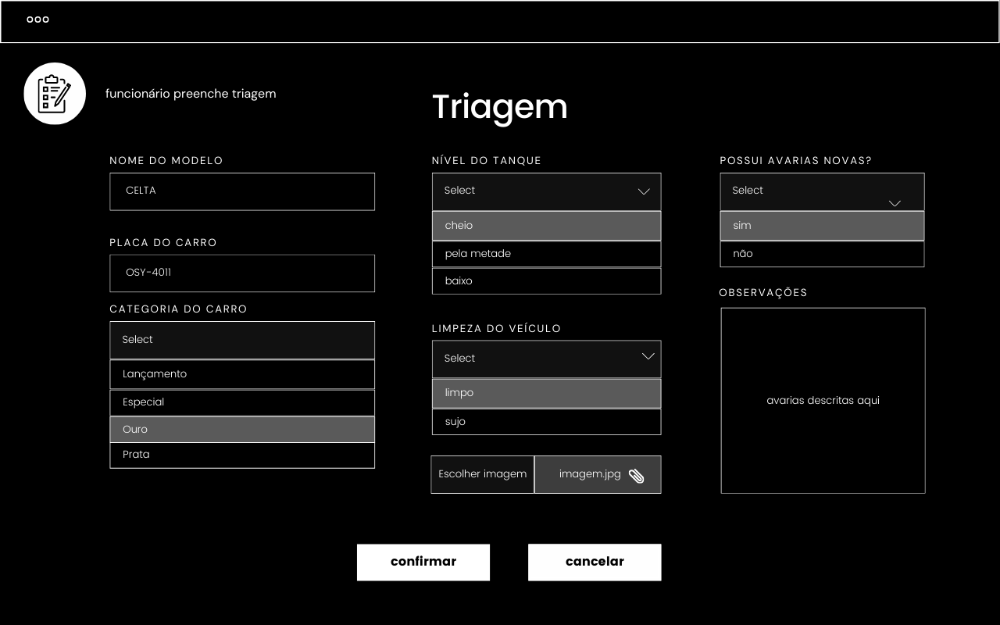
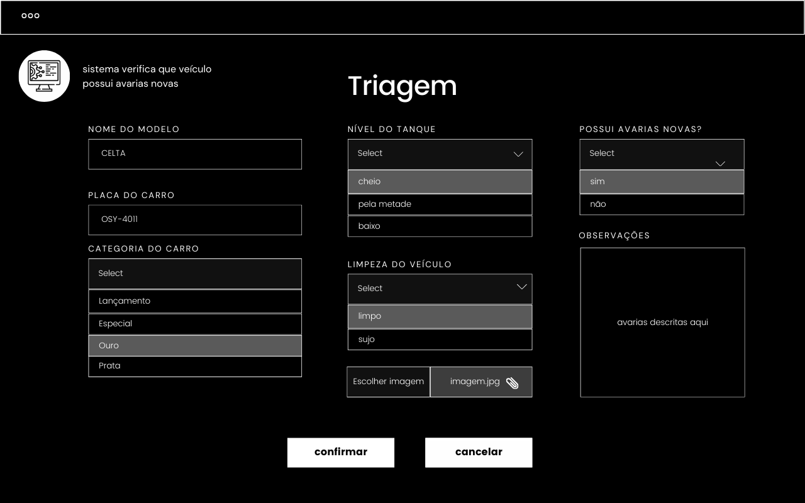
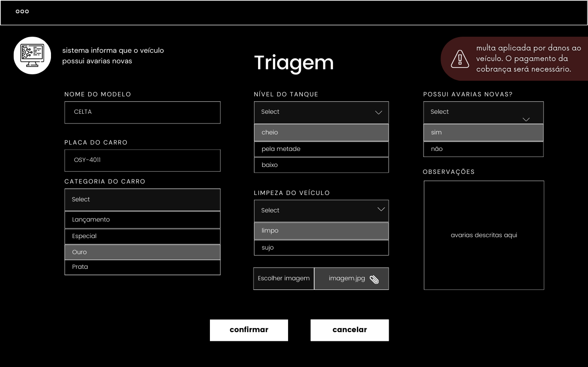

## Aplicação de multas

`O sistema deve aplicar multa a partir das seguintes infrações:`
```markdown
• Caso o carro seja entregue sujo;
• Caso o carro o carro não seja entregue totalmente abastecido;
• Caso a entrega seja feita depois do prazo acordado;
• Caso o condutor cause danos ao veículo e não pague a cobrança feita pela locadora.

	Assim como:

• É registrada uma multa por locação, independentemente do número de infrações cometidas;
• As multas são registradas permanentemente no perfil do sócio;
• O cliente não poderá efetuar outra locação até efetuar o pagamento da multa.
• Após três multas vinculadas ao perfil do cliente, nenhuma locação poderá ser mais efetuada.

```


**4º fluxo secundário - Danos ao veículo**

| Protótipo |
| --- |
|  |
|  |
| |
| |
|  |
|  |

