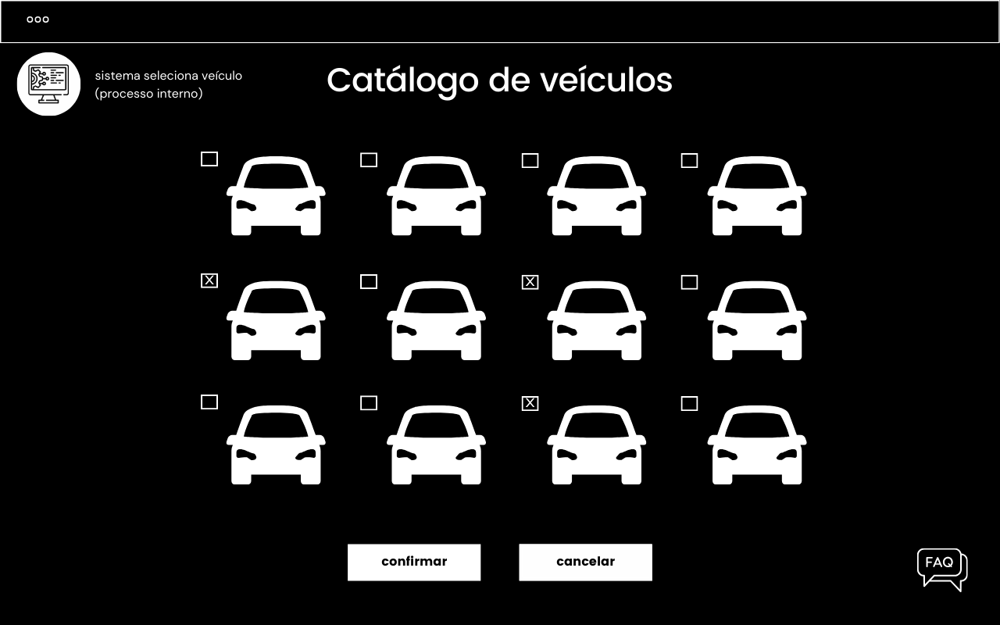
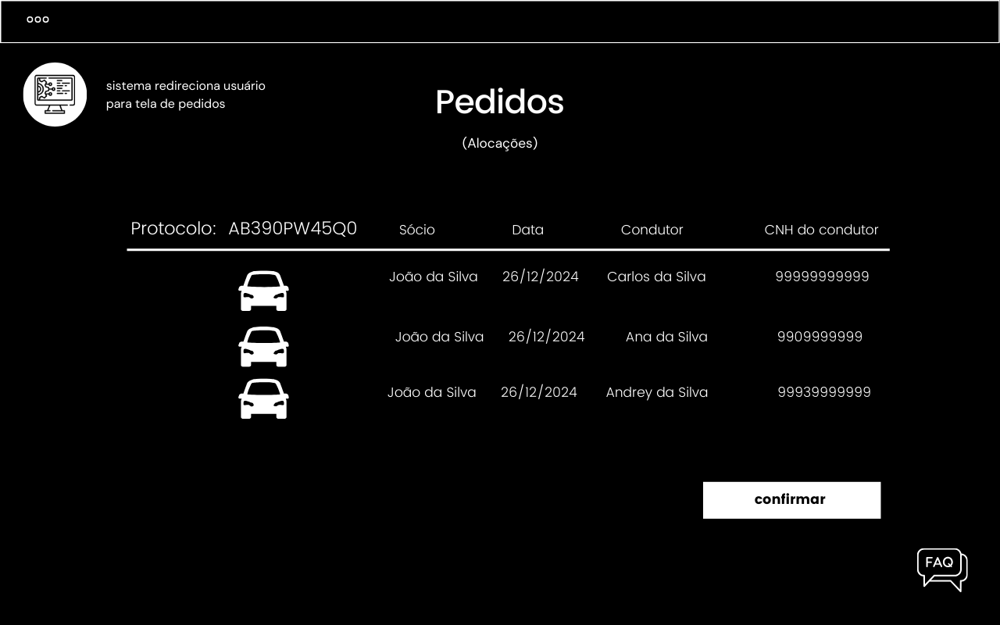
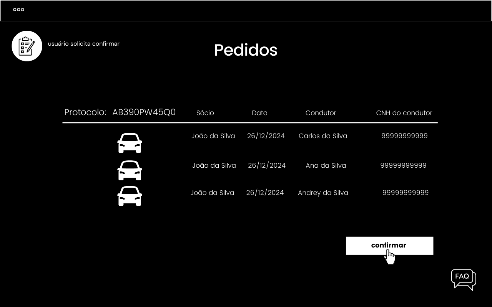
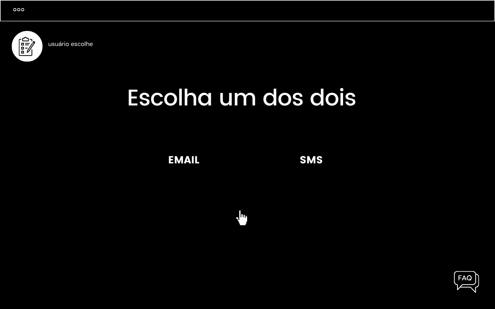
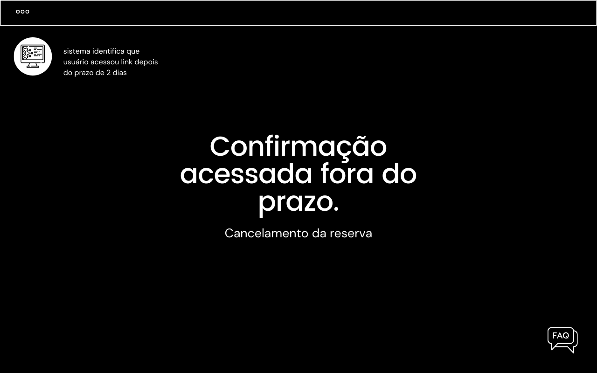

## Confirmação

```markdown
O sistema deve enviar notificações automáticas ao cliente informando sobre a disponibilidade do veículo reservado, sob a condição de que o cliente terá um prazo de 2 dias para responder à notificação confirmando ou cancelando a reserva. Caso contrário, o veículo será disponibilizado para o próximo cliente na fila de espera.
```


**5º fluxo secundário - Usuário responde a notificação fora do prazo**

| Protótipo |
| --- |
| |
| |
|  |
|  |
|  |
|  |
|  |


