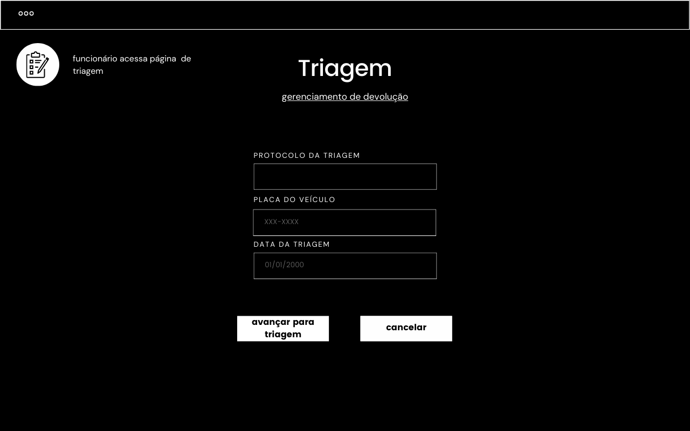
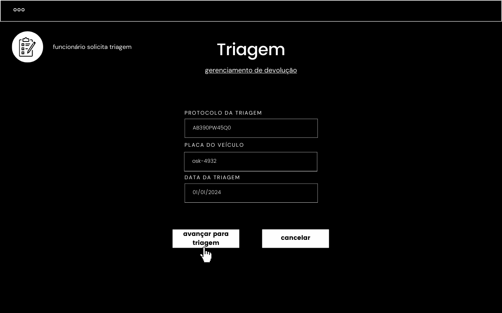
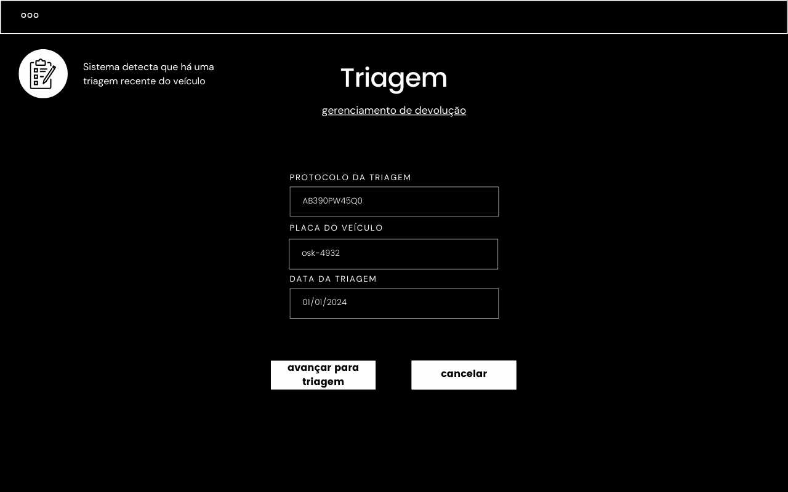
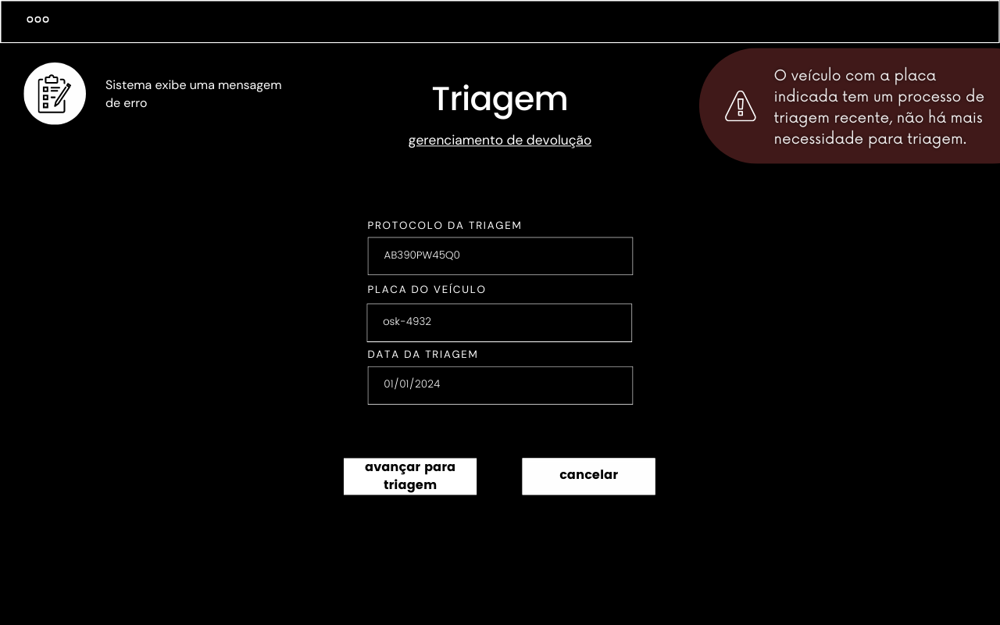

## Cadastro do usuário

`O sistema deve exigir que seja realizada uma triagem do veículo antes de cada locação para verificar e registrar possíveis avarias ou problemas existentes. Os resultados da triagem devem ser cadastrados no sistema, documentando o estado do veículo no momento da retirada pelo cliente. Em caso de novas avarias identificadas após a devolução, o sistema deve comparar com o registro anterior, permitindo uma cobrança justa ao cliente apenas pelos danos que ocorreram durante o período de locação.`

**2º fluxo secundário - Funcionário tenta realizar triagem de veículo incorreto**

| Protótipo |
| --- |
|  |
|  |
|  |
|  |
